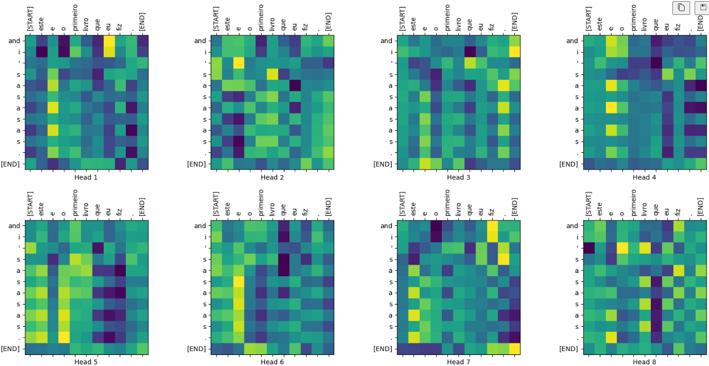
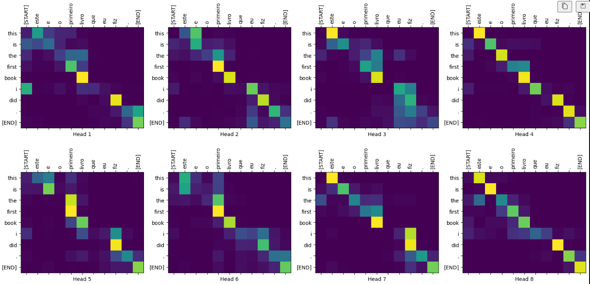

Este documento faz uma análise dos resultados obtidos a partir do treinamento de um modelo de tradução automática. O modelo foi treinado para traduzir frases do português para o inglês utilizando um conjunto de dados obtidos no [projeto de tradução aberta TED Talks](https://www.ted.com/participate/translate) que contém aproximadamente 50.000 exemplos de treinamento, 1.100 exemplos de validação e 2.000 exemplos de teste. Abaixo, são destacados os principais pontos positivos e negativos observados durante o processo.

## Pontos Positivos

* **Redução de recursos 	**: O modelo de transformador lida com entradas de tamanho variável usando pilhas de camadas de autoatenção em vez de RNNs ou CNNS, diminuindo o custo de processamento.
* **Traduções Coerentes**: As previsões são geralmente próximas ao **ground truth**, indicando que o modelo aprendeu bem a tarefa de tradução.
* **Melhora no Treinamento**: A precisão melhora ao longo das épocas, e a **loss** diminui, mostrando que a RN está aprendendo.

## Pontos Negativos

- **Ajuste no codigo**: ajuste nas dependencias do codigo.

* **Baixa Acurácia Inicial**: Nas primeiras épocas, a acurácia é muito baixa, indicando que o modelo precisa de mais iterações para convergir.
* **Erros de Tradução**: Algumas traduções apresentam falhas na gramática ou perda de significado, o que pode indicar a necessidade de refinamento no modelo ou dataset.
* **Tempo de Treinamento Elevado**: Cada época leva um tempo considerável, o que pode dificultar a experimentação com hiperparâmetros.

## CPU X GPU

### **Tempo de Treinamento**

* **CPU**: O treinamento na CPU levou aproximadamente **4548 segundos (cerca de 1h15min) para uma única época**.
* **GPU**: O mesmo treinamento na GPU levou significativamente menos tempo, cerca de **100-150 segundos por época**.

### **Vantagens da GPU**

* **Redução do Tempo de Treinamento**: Como visto na comparação, o uso de GPU pode reduzir o tempo de treinamento em mais de **30x**, possibilitando experimentações mais rápidas.

### **Limitações da CPU**

* **Processamento Sequencial**: CPUs possuem menos núcleos de alto desempenho, o que limita a execução de cálculos matriciais em paralelo.
* **Tempo Extenso de Treinamento**: Como observado, a CPU leva muito mais tempo para completar o mesmo processo, tornando inviável o ajuste fino de hiperparâmetros.

## Resultados

### **Input CPU :**

- **lr:** **0.0006~0.0014**
- **epsilon:** **1e-9**
- **epoch: 1**

### **Accuracy** : 12%

### **Input GPU**

- **lr:** **0.0006~0.0014**
- **epsilon:** **1e-9**
- **epoch: 20**

### **Accuracy** : 68%	

## Proximos passos

Realizar testes em um processador com maior quantidade de núcleos para melhorar a velocidade de treinamento. Com o objetivo de completar as 10 épocas mais rapidamente, permitindo uma comparação mais precisa entre diferentes configurações de hardware como o shrek2.
